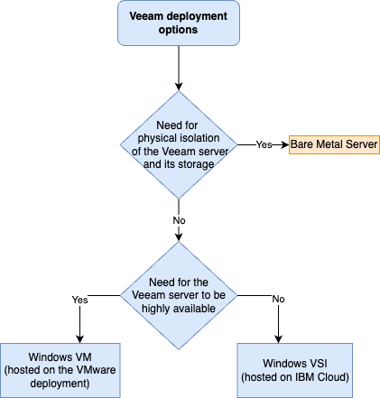

---
copyright:
  years: 2023
lastupdated: "2023-12-28"

subcollection: vmware-cross-region-dr

keywords:
---
{{site.data.keyword.attribute-definition-list}}

# Compute design

{: \#compute-design}

## Requirement

- " All-in-one" deployment
- Isolation between environment running the workloads to protect and the backup/disaster recovery solution

## Veeam Deployment architecture decision tree

Before you deploy Veeam

Here are some of the key considerations and decisions that are needed to deploy Veeam on VM or on a Baremetal n OBM cloud.

On IBM Cloud classic, 3 deployment options are available for the Veeam solution:

- IBM Cloud classic VSI
- VM hosted on the IBM Cloud VMware deployment (enabling protection from vSphere High Availability but requiring extra networking configuration)
- Bare Metal Server

All these deployment options are “all-in-one” and contain all the minimum needed Veeam components for back up and replication between two IBM Cloud regions.

Figure 1 Veeam deployment options decision tree

The above decision tree lists options and approach for a Veeam deployment on IBM cloud.

In this pattern we decided to use a bare metal server to benefit from an all-in-one backup and replication solution isolated from the environment hosting the backed-up VMware workloads and IBM Cloud and to maximize performance.

Add note regarding agent for specific applications use case

Veeam 12.1 Backup Agent Supported: [https://helpcenter.veeam.com/docs/backup/agents/supported_veeam_agents.html?ver=120](https://helpcenter.veeam.com/docs/backup/agents/supported_veeam_agents.html?ver=120)

## Veeam all in one

All these deployment options are “all-in-one” and contain all the minimum needed Veeam components, for back up and replication between two IBM Cloud regions installed on a Windows Server 2019 operating system.

In this pattern we consider that the Veeam solution will be used for both backup and replication (DR), which we believe will be the typical use case of customers using Veeam.

As a result, in order to isolate the backup solution from the environment hosting the backed-up VMware workloads and IBM Cloud and to maximize performance, we decided to use a bare metal server deployment option.

## DR site compute sizing

The DR environment needs to always have enough bare metals ESXi provisioned to be able to bring up the replicas of the protected workloads when a disaster renders the production VMware environment unavailable.

To optimize the cost of having bare metal hosts constantly provisioned on the DR site with no actual workload, a possibility is to run “sacrificial” development or test workloads, for which no DR is needed and that could be powered off to free capacity in the event of a DR occurrence, on the DR site. Offloading this type of workloads to the DR site also reduces the number/size of ESXi hosts needed on the production site.
