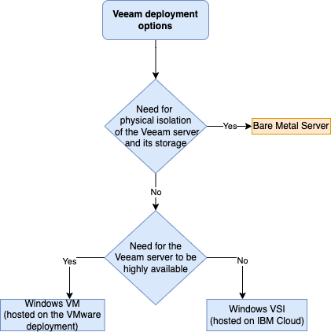
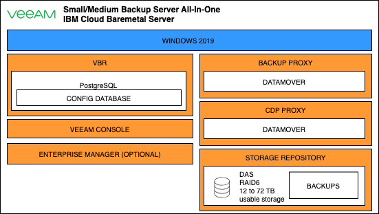

---
copyright:
  years: 2023
lastupdated: "2023-12-28"

subcollection: vmware-cross-region-dr

keywords:
---
{{site.data.keyword.attribute-definition-list}}

# Compute design

{: \#compute-design}

## Veeam Deployment architecture decision tree

Deployment decision tree

On IBM Cloud classic, 3 deployment options are available for the Veeam solution:

- IBM Cloud classic VSI
- VM hosted on the IBM Cloud VMware deployment (enabling protection from vSphere High Availability but requiring extra networking configuration)
- Bare Metal Server

All these deployment options are “all-in-one” and contain all the minimum needed Veeam components for back up and replication between two IBM Cloud regions.

In this pattern we decided to use a bare metal server to benefit from an all-in-one backup and replication solution isolated from the environment hosting the backed-up VMware workloads and IBM Cloud and to maximize performance.

## **Deployment considerations for Production site**

On the source (production) site in the first IBM Cloud region, all the necessary Veeam Backup and Recovery components are installed on the same bare metal server:

Veeam Components running on the all-in-one bare metal server deployment

## **Deployment considerations for DR site**

On the DR site, in the second IBM Cloud region, the following additional components are required:

- At least 1 Veeam backup proxy (only if standard Veeam replication, with an RPO in hours, will be used)
- At least 1 Veeam CDP proxy (only if continuous data protection replication, with an RPO in seconds, will be used)

## **Backup Proxies considerations**

**Additional Veeam backup/CDP proxies**

Any existing Windows or Linux physical or virtual server can be converted into a backup or CDP proxy. This is achieved by assigning the proper role to these virtual or physical servers from the Veeam Backup and Replication console.

**Do we really need another bare metal server in the DR region? When reading VBR user guide I have the impression we only need some backup/CDP proxies in the target region?**

In this pattern we decided to use IBM Cloud linux VSIs running in the DR environment as Veeam backup/CDP proxies. This allows us to limit the costs while keeping the networking as simple as possible (not requiring any portable IP address or GRE tunnel).

See [https://helpcenter.veeam.com/docs/backup/vsphere/backup_proxy.html?ver=120](https://helpcenter.veeam.com/docs/backup/vsphere/backup_proxy.html?ver=120) and [https://helpcenter.veeam.com/docs/backup/vsphere/cdp_proxy.html?ver=120](https://helpcenter.veeam.com/docs/backup/vsphere/cdp_proxy.html?ver=120) for more information on adding backup/CDP proxies.

Note that for CDP, an I/O filter needs to be installed on every VMware **consolidated** cluster where protected/restored VM is/will be running (see [https://helpcenter.veeam.com/docs/backup/vsphere/cdp_io_filter_install.html?ver=120](https://helpcenter.veeam.com/docs/backup/vsphere/cdp_io_filter_install.html?ver=120))

Note that Veeam recommends having at least 2 backup/CDP proxies on each site to provide some redundancy.

Replication performance will increase when additional proxies are added as the replication jobs then get distributed across the proxies.

This pattern only shows the minimum components needed for a functional replication between the 2 regions.

**DR site compute sizing**

The DR environment needs to permanently have enough bare metals ESXi provisioned to be able to bring up the replicas of the protected workloads when a disaster renders the production VMware environment unavailable.

To optimize the cost of having bare metal hosts constantly provisioned on the DR site with no actual workload, a possibility is to run “sacrificial” development or test workloads, for which no DR is needed and that could be powered off to free capacity in the event of a DR occurence, on the DR site. Offloading this type of workloads to the DR site also reduces the number/size of ESXi hosts needed on the production site.
