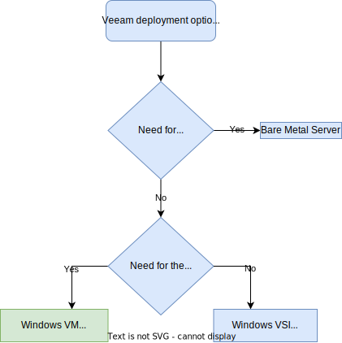

---
copyright:
  years: 2024
lastupdated: "2024-2-08"

subcollection: vmware-cross-region-dr

keywords:
---
{{site.data.keyword.attribute-definition-list}}

# Compute design

{: \#compute-design}

This pattern expands on the compute aspect of the IBM Architecture framework in respect of the Veeam for disaster recovery for VMware workloads pattern.

## Requirement

The requirements for the compute aspect for the Veeam for disaster recovery for VMware workloads pattern focuses on the following:

- The compute required for the Veeam components.
- The compute aspect for the recovered workloads.

## Veeam Architecture Components

The requirements for the Veeam components are listed below:

- Leverage the add-on optional service deployment were possible to enable a quicker and easier deployment.
- Only deploy additional components if required for resiliency or performance.

On IBM Cloud classic, the add-on optional Veeam service has three compute deployment options:

- Bare metal server with local storage.
- IBM Cloud classic Virtual Server Instance (VSI) with iSCSI storage.
- A virtual machine with iSCSI storage hosted on the IBM Cloud VMware deployment.

All these deployment options are “all-in-one” i.e. a number of Veeam components are all installed on the same compute and contain the minimum number of components needed for backing up the workloads hosted on the vCenter server instance.

All the deployments, deploy the Veeam components onto a Microsoft Windows operating system.

Additionally, an optional Linux hardened repository, using a bare metal server with local storage, can be deployed along with the bare metal server, VSI or virtual machine described above.

**The bare metal server option is a good choice for the following reasons:**

- Managed service providers who don't want the dependency of hosting their service on a customer-managed cluster.
- 10Gb network interfaces on the same network as the ESXi hosts enabling high-performance efficient data transfer using the network transport mode.
- "All-in-one" deployments for VMware clusters using IBM Cloud storage backed datastores. As it is good practice for backup copies of data to be located on different storage to the primary copy, having backups on local storage and the primary copy on IBM Cloud storage adheres to this best practice.
- Where data sovereignty requirements dictate that shared storage, such as IBM Cloud storage services, cannot be used.

**The virtual machine is a good choice for the following reasons:**

- Leveraging vSphere HA for resiliency of the hosted Veeam components from hardware failure.
- While this option uses iSCSI storage for the backup repository, a Linux hardened repository can be ordered and used to hold backups of the primary copy on different storage media. Alternatively, IBM Cloud Object Storage can be used to provide a different storage media.
- "All-in-one" deployments where the VMware Backup Proxy can use the Virtual Appliance (hot-add) transport mode.

**The virtual server instance is a good choice for the following reasons:**

- The Windows operating system license is included in the charges for the VSI.
- 1Gb network interface on the same network as the ESXi hosts enabling efficient data transfer using the network transport mode.

The decision tree below can be used to decide which option to select.

Figure 1 Veeam deployment options decision tree

For this disaster recovery pattern, there was no requirement for physical isolation of the backup, therefore, the virtual machine option was selected. The recovery site was selected for the deployment so that the Veeam Backup & Replication server was available instantly for disaster recovery invocation

If this pattern was also to include backup and physical isolation was required, then consider the following:

- Deploy a separate instance of Veeam at the protected site either using a bare metal server or a VSI or virtual machine with a Linux hardened repository. This topology does enable separation oif responsibilities between backup and disaster recovery, but at the expense of Veeam licensing.
- Deploy bare metal servers in the protected region for uses a backup repositories.
- Use IBM Cloud Object Storage with Veeam direct access or gateway access. See [Object Storage Repository Deployment](https://helpcenter.veeam.com/docs/backup/vsphere/object_storage_repository.html?ver=120#object-storage-repository-deployment){: external}.

## Recovery Site

The recovery environment needs to always have enough bare metals ESXi hosts provisioned to be able to bring up the virtual machine replicas of the protected workloads when a disaster renders the protected VMware environment unavailable.

To optimize the cost of having bare metal hosts constantly provisioned on the recovery site with no actual workload, a possibility is to run “sacrificial” development or test workloads, for which no disaster recovery is needed and that could be powered off to free capacity in the event of a disaster recovery invocation or test. Offloading this type of workloads to the DR site also reduces the number and size of ESXi hosts needed on the protected site.
