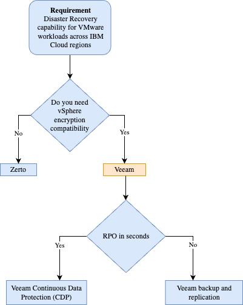

---
copyright:
  years: 2023
lastupdated: "2024-1-30"

subcollection: <vmware-cross-region-dr>

keywords:
---
{{site.data.keyword.attribute-definition-list}}

# Compute Overview

{: \#overview}

This pattern describes Veeam for disaster recovery for VMware workloads where both the protected and recovery sites are in IBM Cloud. While this pattern describes a Veeam deployment using the add-on additional services only available with the IBM Cloud vCenter Server platform, the pattern can be extrapolated for use with the VCF in VPC platform, however, the deployment of the Veeam server will need to be done manually using IBM Cloud licenses ordered through the IBM Cloud for VMware Solutions console.

This pattern is cross-region, which assumes that the recovery site is in a different geographic region than the protected location e.g. protected site is Frankfurt and the recovery location is Madrid. However, if required the pattern can use a recovery site in the same geographic region if required e.g. Frankfurt AZ1 and Frankfurt AZ3.

Check to ensure that the minimum distance between the protected and recovery sites meets your requirement.
{: important}

The decision tree, shown below, has been used to select Veeam as the disaster recover product.

## IBM Architecture Framework

Following the Architecture Framework, the VMware Disaster Recovery solution using Veeam covers design considerations and architecture decisions for the following aspects and domains:

- Compute: Virtual Servers
- Storage: Primary Storage, Backup Storage
- Networking: Enterprise Connectivity, Segmentation and Isolation, Cloud Native Connectivity, Load Balancing, DNS
- Security: Data Security, Identity and Access Management, Application Security, Infrastructure and Endpoint Security
- Resiliency: High Availability, Backup and Restore
- Service Management: Monitoring, Logging, Auditing, Alerting

The Architecture Framework provides a consistent approach to design cloud solutions by addressing requirements across a set of "aspects" and "domains", which are technology-agnostic architectural areas that need to be considered for any enterprise solution. For more details, see [Introduction to the Architecture Framework](file:////docs/architecture-framework).

### Requirements

Using the IBM Architecture framework, the table below describes the requirements for the diaster recovery pattern:

| **Aspect**   | **Requirement**                                                                                                                                                                                                          |
| ------------------ | ------------------------------------------------------------------------------------------------------------------------------------------------------------------------------------------------------------------------------ |
| Compute            | Disaster Recovery for VMware workloads                                                                                                                                                                                         |
| Storage            | Storage to support Veeam components and to replicate the protected virtual machines                                                                                                                                            |
| Security           | Provide data encryption at rest and in transit                                                                                                                                                                                 |
| Resiliency         | Replicate VMware workloads from a protected site to a recovery site in a different region for failover of workloads in the event of failure in the protected site. Failover that meets the required RTO/RPO of the application |
| Service Management | Monitor the usage and performance of the Veeam components. Enable logging and alerting to DevOps tooling                                                                                                                       |

Table 1. Veeam disaster recovery pattern for VMware Workloads on IBM Cloud Classic (VCS) requirements

### Components

Using the IBM Architecture framework, the table below describes how the pattern's components deliver against the requirements for the diaster recovery pattern:

| **Aspect**   | **Component**                                      | **How the component is used**                                                                                                                                                                                                                                                                                                                            |
| ------------------ | -------------------------------------------------------- | -------------------------------------------------------------------------------------------------------------------------------------------------------------------------------------------------------------------------------------------------------------------------------------------------------------------------------------------------------------- |
| Data               | PostgreSQL, MS SQL Express                               | Veeam Backup & Replication uses a PostgreSQL database to store its configuration. Veeam ONE uses MS SQL Express for its database                                                                                                                                                                                                                               |
| Compute            | VMware virtual machine                                   | The virtual machine option was selected for this pattern so that the Veeam Backup & replication application, VMware Backup and CDP proxies could leverage vSphere HA and be restarted due to any hardware issues                                                                                                                                               |
| Storage            | vSAN or IBM Cloud File Storage, IBM Cloud Object Storage | vSAN or IBM Cloud File Storage is used for the VMWare datastores in both the protected and recovery sites. For the Veeam Backup & replication configuration backup, IBM Cloud Object Storage is used                                                                                                                                                           |
| Networking         | IBM Cloud backbone                                       | The IBM Cloud private network is used for replicate traffic between the proxies in the regions. Control traffic between the Veeam Backup & Replication server and the data-plane Veeam components also traverses this network                                                                                                                                  |
| Resiliency         | Veeam replication and CDP                                | Veeam replication and CDP provide the resiliency of the VMware virtual machines to be protected and recovered. The resiliency of the Veeam data-plane components is accomplished by deploying multiple proxies. For the Veeam Backup & Replication server, vSphere HA and backups of the configuration database enables resiliency of the Veeam control-plane. |
| Service Management | Veeam ONE                                                | Veeam ONE, part of the Veeam Availability Suite, provides visibility into Veeam-protected workloads and provides; monitoring, reporting, alerting, diagnostics with automated resolutions and infrastructure utilization and capacity planning.                                                                                                                |

Table 2. Veeam Disaster Recovery solution for VMware Workloads on IBM Cloud Classic (VCS) components
