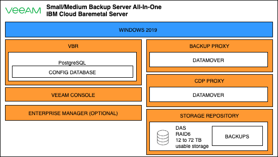

---
copyright:
years: 2023
lastupdated: "2023-12-26"
subcollection: vmware-cross-region-dr
---
# VMware Disaster Recovery on IBM Cloud using Veeam.

Reference architecture using Veeam for a DR solution for VMware workloads at source and target locations.

- Supported by delivery and orderable via Cloud Catalog with near real-time RPO, RTO.
- Protected workloads in DR zone must support Data Encryption. GPDR and other regulated markets requires PI/SPI data to be protected according to the laws.

## Veeam Architecture overview

{: \#architecture-diagram}

Here is the Architecture overview

Key Components of Veeam on IBM Cloud

1. **IBM Cloud Infrastructure:**

- VMware-based virtualized environment hosted on IBM Cloud.
- Multiple ESXi hosts forming a cluster for running virtual machines.

1. **Veeam Backup & Replication Server:**
   1. Deployed within the VMware environment as a virtual machine.
   2. Responsible for managing backup and replication jobs.
2. **Veeam Backup Repository:**
   1. A dedicated storage location for storing backup files.
   2. Can be implemented as an IBM Cloud Object Storage or a high-performance block storage solution.
3. **Veeam Backup Proxy:**
   1. Installed on a separate virtual machine.
   2. Facilitates data transfer between VMware infrastructure and the Veeam Backup & Replication server.
4. **Veeam Backup Console:**
   1. Web-based console for configuring and monitoring backup jobs.
   2. Accessible from administrators' workstations.
5. **Continuous Data Protection (CDP) Server:**
   1. Deployed as a virtual appliance.
   2. Ensures real-time replication of VMs for near-zero RPO (Recovery Point Objective).

Figure 1 Veeam Disaster Recovery solution for VMware Workloads on IBM Cloud Classic (VCS) architecture

In this pattern, we are assuming that two IBM Cloud vCenter server instances have been provisioned in two different IBM Cloud regions. One of these instances will be used for production workloads, the other one will be mostly used for disaster recovery (but potentially also for development and test workloads that can be “sacrificed” when a disaster recovery is triggered as described in the “DR site compute sizing” section below)

Connectivity from on premises to any of the IBM Cloud environments is considered as out of scope for this pattern.

The Veeam solution available from IBM Cloud VMware Solutions catalog is based on Veeam Backup and Replication 12 and Veeam Availability Suite 12.

The solution enables the backup of VMware workloads as well as their replication between different ESXi hosts/clusters/environments.

Although this pattern focuses on using Veeam for disaster recovery, we will quickly cover some backup aspects when it makes sense as we believe this is the most common use case for Veeam.

## Veeam solution components

**Production site**

On the source (production) site in the first IBM Cloud region, all the necessary Veeam Backup and Recovery components are installed on the same bare metal server

Figure 2 Veeam Components running on the all-in-one bare metal server deployment

Veeam Components running on the all-in-one bare metal server deployment

The bare metal server is provisioned with a Windows Server 2019 operating system, the Veeam components are installed as applications on top of it.

More details on the components can be found here: [https://cloud.ibm.com/docs/vmwaresolutions?topic=vmwaresolutions-veeam-bms-archi-components](https://cloud.ibm.com/docs/vmwaresolutions?topic=vmwaresolutions-veeam-bms-archi-components)

Based on the environment size and the customer’s requirements, additional backup/CDP proxies can be added.

**Additional Veeam backup/CDP proxies**

Any existing Windows or Linux physical or virtual server can be converted into a backup or CDP proxy. This is achieved by assigning the proper role to these virtual or physical servers from the Veeam Backup and Replication console.

In this pattern we decided to use IBM Cloud linux VSIs running in the DR environment as Veeam backup/CDP proxies. This allows us to limit the costs while keeping the networking as simple as possible (not requiring any portable IP address or GRE tunnel).

See [https://helpcenter.veeam.com/docs/backup/vsphere/backup_proxy.html?ver=120](https://helpcenter.veeam.com/docs/backup/vsphere/backup_proxy.html?ver=120) and [https://helpcenter.veeam.com/docs/backup/vsphere/cdp_proxy.html?ver=120](https://helpcenter.veeam.com/docs/backup/vsphere/cdp_proxy.html?ver=120) for more information on adding backup/CDP proxies.

Note that for CDP, an I/O filter needs to be installed on every VMware **consolidated** cluster where protected/restored VM is/will be running (see [https://helpcenter.veeam.com/docs/backup/vsphere/cdp_io_filter_install.html?ver=120](https://helpcenter.veeam.com/docs/backup/vsphere/cdp_io_filter_install.html?ver=120))

Note that Veeam recommends having at least 2 backup/CDP proxies on each site to provide some level of redundancy.

Replication performance will increase when additional proxies are added as the replication jobs then get distributed across the proxies.

This pattern only shows the minimum components needed for a functional replication between the 2 regions, the exact number and types of Veeam proxies needed depend on each customer’s environment and requirements.

**DR site**

On the DR site, in the second IBM Cloud region, the following additional components are required:

- At least 1 Veeam backup proxy (only if standard Veeam replication, with an RPO in hours, will be used)
- At least 1 Veeam CDP proxy (only if continuous data protection replication, with an RPO in seconds, will be used)

**Application-aware backups**

**For VMs running specific applications (Microsoft Active Directory, Microsoft Exchange, Microsoft SharePoint, Microsoft SQL Server, **Ora**c**le** Database or PostgreSQL) Veeam can create transactionally consistent backups and replicas. In order to achieve this a Veeam agent needs to be installed in the VM (the installation is done either by **a  “**guest interaction proxy” for windows VMs or the backup server for other types of VMs).**

**S**ee[https://helpcenter.veeam.com/docs/backup/vsphere/guest_interaction_proxy.html?ver=120](https://helpcenter.veeam.com/docs/backup/vsphere/guest_interaction_proxy.html?ver=120) 

a**nd** 

****[https://helpcenter.veeam.com/docs/backup/vsphere/guest_processing.html?ver=120](https://helpcenter.veeam.com/docs/backup/vsphere/guest_processing.html?ver=120) for more information**.**

## Requirements

| **Aspect** | **Requirement**                                                                                                                                             |
| ---------------- | ----------------------------------------------------------------------------------------------------------------------------------------------------------------- |
| Compute          | Disaster Recovery for VMWare Workloads                                                                                                                            |
| Storage          | Storage to support Veeam component and to backup the workloads                                                                                                    |
| Security         | Provide data encryption at rest and in transit                                                                                                                    |
| Resiliency       | Replicate VMware workloads from production site to an alternate site in a different region for failover of workloads in the event of failure in the primary site. |
|                  | Failover that meets the RTO/RPO application requirements                                                                                                          |

Table 1. Veeam Disaster Recovery solution for VMware Workloads on IBM Cloud Classic (VCS) requirements

## Components

| **Aspect**     | **Component**          | **How the component is used**                                                                                                                      |
| -------------------- | ---------------------------- | -------------------------------------------------------------------------------------------------------------------------------------------------------- |
| Data                 | PostgreSQL                   | Embedded database used as the Veeam Backup and Replication configuration database                                                                        |
| Compute              | Bare Metal on IBM Cloud      | All in One backup and replication solution (backup repository, backup/CDP proxy, backup server, console) physically isolated from the VMware environment |
|                      | IBM Cloud classic VSI        | Veeam backup/CDP proxies on the disaster recovery site                                                                                                   |
| Storage              | Direct Attached Storage      | Storage repository for backup                                                                                                                            |
|                      | Cloud Object Storage         | Optional – Can be used as second tier backup storage or as a Veeam scale-out backup repository                                                          |
| Networking           | IBM Cloud backbone           | Replication Traffic between regions                                                                                                                      |
| **Resiliency** | Veeam Backup and Replication | DR solution for VMware workloads at source and target locations                                                                                          |

Table 2. Veeam Disaster Recovery solution for VMware Workloads on IBM Cloud Classic (VCS) components
