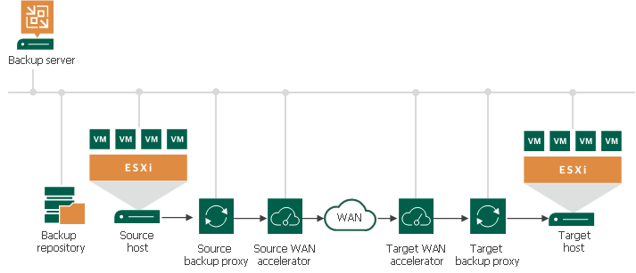
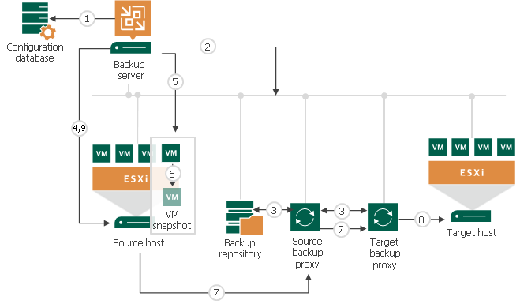
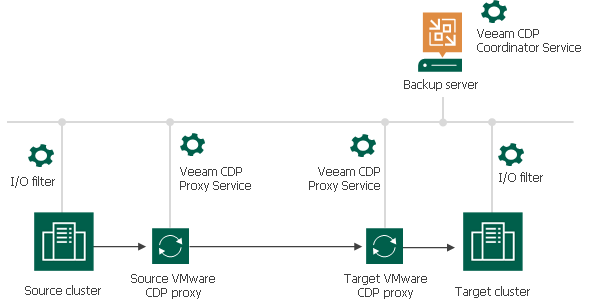

---
copyright:
  years: 2023
lastupdated: "2023-12-26"

subcollection: pattern-sap-on-vpc

keywords:
---

{{site.data.keyword.attribute-definition-list}}

# Replication design

## Requirements:

-   Provide a way to replicate the VMware workloads in accordance with the target RPO

The Veeam solution supports two types of replications, Veeam “standard” replication and Veeam Continuous Data Protection (CDP) replication.

## Standard Veeam replication

Standard Veeam replication is based on vSphere snapshots. During the first replication cycle a full replica of the data of the protected VM is created on the DR site. The following replication cycles are incremental, only changed blocks are copied (Veeam leverages VMware vSphere Changed Block Tracking (CBT), introduced in vSphere 7)

To adapt to IBM Cloud/recreate (remove the wan accelerators) – “standard” replication architecture.

To adapt to IBM Cloud/recreate – “standard” replication architecture.

Standard Veeam replication is recommended to protect VMs with a recovery point objective (RPO) in hours. If a more aggressive RPO is needed, Veeam Continuous Data Protection must be used.

**Veeam Continuous Data Protection (CDP)**

Veaam CDP constantly replicates the I/O operations of the VMs. It uses vSphere APIs for I/O filtering (VAIO) to read and process the communications between the protected VMs and their storage. CDP requires the installation of an I/O filter on the ESXi clusters where the protected workloads are running. The I/O filter is not automatically installed on the VCS clusters when the Veeam all-in-one is deployed, this needs to be manually done following Veeam documentation (<https://helpcenter.veeam.com/docs/backup/vsphere/cdp_io_filter_install.html?ver=120>).

CDP does not create or use snapshots and allows a much lower RPO (near zero) than standard snapshots based replication.

The I/O operations data is stored in the target datastore and associated to short-term restore points (allowing recovering to seconds or minutes before a disaster). Short term restore points are kept for a maximum of 24 hours. To recover VMs to an older state, additional “long term” restore points can be defined to allow recovering a VM state from hours or days ago.

More information on CDP are available here: <https://helpcenter.veeam.com/docs/backup/vsphere/cdp_replication.html?ver=120>

Note that CDP only works for powered on VMs

## Additional Resiliency considerations

Resiliency Region

-   Ensure the location of all service components and their required regulatory compliance can be achieved. Example, with a single campus MZR or data center the placement of the KMIP for VMware and Hyper Protect Crypto Services is not local to the VMWare (VCS) instance.
-   Geographical distance - the risk that the same physical event impacts multizone regions is low.
-   Resiliency - logical services in each region are independent, such that a failure in one service does not impact the service in the other region.

Some factors to take into consideration to improve the RPO and RTO of the protected VMware workloads:

-   The VMware vSphere clusters in the recovery region are provisioned and are available to run workloads as soon as these workload VMs are started after DR invocation.
-   The core management components in the recovery region (vCenter Server and the NSX-T™ Manager cluster) are running, so there is no infrastructure deployment wait time.
-   The recovery infrastructure is being monitored and compliant through the management toolset (VMware Aria® Operations™), so that the recovery infrastructure resources are healthy, compliant, and ready to be used
-   A “standby” VSI or bare metal with all the Veeam components installed on it but not configured exists in the DR site to minimize rebuild of the DR solution (the only necessary operation being to import the backed up Veeam configuration)
