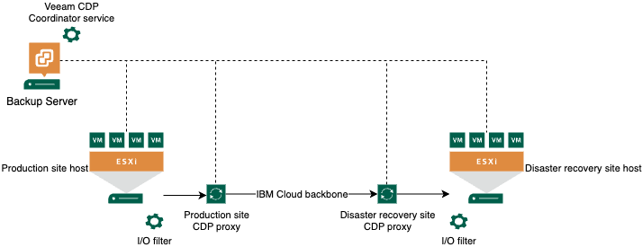

---
copyright:
  years: 2023, 2024
lastupdated: "2024-02-29"

subcollection: pattern-sap-on-vpc

keywords:
---
{{site.data.keyword.attribute-definition-list}}

# Replication design
{: #replication-design}

The following are replication design requirements and considerations for the VMware Disaster Recovery with Veeam pattern.

The Veeam solution supports two types of replications, Veeam “standard” replication and Veeam Continuous Data Protection (CDP) replication. It's required to provide a way to replicate the VMware workloads in accordance with the target RPO.

## Standard Veeam replication
{: #standard-replication}

Standard Veeam replication is based on vSphere snapshots. During the first replication cycle, a full replica of the data of the protected virtual machine (VM) is created on the disaster recovery (DR) site. The following replication cycles are incremental and only changed blocks are copied. Veeam uses VMware vSphere Changed Block Tracking (CBT) that's introduced in vSphere 7.

Standard Veeam replication is recommended to protect VMs with a recovery point objective (RPO) in hours. If a more aggressive RPO is needed, Veeam Continuous Data Protection must be used.
{: note}

## Veeam Continuous Data Protection (CDP)
{: #Veeam-continuous-data}

Veeam Continuous Data Protection (CDP) constantly replicates the I/O operations of the VMs. It uses vSphere APIs for I/O filtering (VAIO) to read and process the communications between the protected VMs and their storage. CDP requires the installation of an I/O filter on the ESXi clusters where the protected workloads are running. The I/O filter is not automatically installed on the VCS clusters when the Veeam all-in-one is deployed and needs to be done manually. For more information, see, [Installing I/O Filter](https://helpcenter.veeam.com/docs/backup/vsphere/cdp_io_filter_install.html?ver=120).

CDP doesn't create or use snapshots and allows a lower RPO (near zero) than standard snapshot-based replications.
{: important}

The I/O operations data is stored in the target data store and associated to short-term restore points, allowing recovery to seconds or minutes before a disaster. Short-term restore points are kept for a maximum of 24 hours. To recover VMs to an older state, more “long term” restore points can be defined to allow recovering a VM state from hours or days ago. For more information, see [Continuous Data Protection (CDP)](https://helpcenter.veeam.com/docs/backup/vsphere/cdp_replication.html?ver=120)

{: caption="Figure 2. Veeam Continuous Data Protection for the Veeam for disaster recovery for VMware workloads pattern. " caption-side="bottom"}

CDP works for only powered on VMs.
{: note}

## Additional resiliency considerations
{: #additional-considerations}

- Ensure the location of all service components and that their required regulatory compliance can be achieved. For example, with a single campus MZR or data center, the placement of the KMIP for VMware and Hyper Protect Crypto Services is not local to the VMWare (VCS) instance.
- Geographical distance: The risk that the same physical event impacts multizone regions is low.
- Resiliency: Logical services in each region are independent, such that a failure in one service does not impact the service in the other region.

Consider the following factors to improve the RPO and RTO of the protected VMware workloads:

- The VMware vSphere clusters in the recovery region are provisioned and are available to run workloads when these workload VMs are started after DR invocation.
- The core management components in the recovery region (vCenter Server and the NSX-T™ Manager cluster) are running, so there is no infrastructure deployment wait time.
- The recovery infrastructure is being monitored and compliant through the management toolset (VMware Aria Operations), so that the recovery infrastructure resources are healthy, compliant, and ready to be used.
- A “standby” VSI or bare metal with all the Veeam components that are installed on it but not configured exists in the DR site to minimize rebuild of the DR solution. This is the only necessary operation to import the backed up Veeam configuration.
