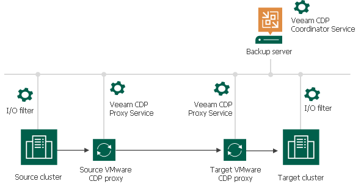

---
copyright:
  years: 2023
lastupdated: "2023-12-26"

subcollection: pattern-sap-on-vpc

keywords:
---

{{site.data.keyword.attribute-definition-list}}

# Resiliency design

{: \#resiliency-design}

Resilency Considerations

Types of replication (standard vs CDP)

Veeam on IBM cloud is based on Veeam Backup and Replication 12 OS Add-on and Veeam Availability Suite 12 Replication mode (virtual appliance replication mode, network replication mode)

## • Resiliency Region

-   Ensure the location of all service components and their required regulatory compliance can be achieved. Example, with a single campus MZR or data center the placement of the KMIP for VMware and Hyper Protect Crypto Services is not local to the VMWare (VCS) instance.
-   Geographical distance - the risk that the same physical event impacts multizone regions is low.
-   Resiliency - logical services in each region are independent, such that a failure in one service does not impact the service in the other region.
-   Management cluster requires sufficient free capacity to host the protected management applications.
-   Workload cluster requires sufficient free capacity to host the protected workloads.
-   In normal operations, workload VMs can run in the recovery region if required. However, there needs to be enough initial capacity in the recovery region to run the recovered workload VMs upon DR invocation. These workloads might be test and development workloads that are sacrificial upon DR.
-   Recovery Point Objective (RPO) and Recovery Time Objective (RTO) depend on many variables. Therefore, the vCenter Server dual region design provides no standard Service Level Agreement (SLA) for RPO or RTO. However, review the following information about RPO and RTO:
-   The VMware vSphere clusters in the recovery region are provisioned and are available to run workloads as soon as these workload VMs are started after DR invocation.
-   The core management components in the recovery region (vCenter Server and the NSX-T™ Manager cluster) are running, so there is no infrastructure deployment wait time.
-   The recovery infrastructure is being monitored through the management toolset (ideally VMware Aria® Operations™), so that the recovery infrastructure resources are healthy, and ready to be used.

**CDP Proxy Reference architecture for a Disaster recovery solution on IBM cloud (Across different Cloud Region)**

-   operates as a data mover and transfers data between the source and target hosts.
-   Role can be assigned to any Windows-managed virtual or physical server added to your Veeam

## Backup & Replication infrastructure.

-   All hosts in a cluster must be of the same major version: 7.x or 6.x
-   VMs on the same cluster must be protected with CDP only by one backup server.
-   One VM can be processed only by one CDP policy.
-   I/O journal size is limited to 254 GB per VM for VSAN
-   CDP works only for powered on VMs
-   Data encryption rules do not apply to traffic between the ESXi host and VMware CDP proxy

## Sizing Recommendations:

-   8 vCPUs dual 10GB network Microsoft Windows OS with 20% RAM storage caching
-   at least 10 GB or 1 GB per each VM disk if more than 10 disks in one CDP policy.
-   Recovery Point Objective (RPO) and Recovery Time Objective (RTO) depend on many variables. Therefore, the vCenter Server dual site design provides no standard Service Level Agreement (SLA) for RPO or RTO.

Some factors to take into consideration to improve the RPO and RTO:

-   The VMware vSphere clusters in the recovery region are provisioned and are available to run workloads as soon as these workload VMs are started after DR invocation.
-   The core management components in the recovery region (vCenter Server and the NSX-T™ Manager cluster) are running, so there is no infrastructure deployment wait time.
-   The recovery infrastructure is being monitored and compliant through the management toolset (VMware Aria® Operations™), so that the recovery infrastructure resources are healthy, compliant, and ready to be used.

# Replication design

{: \#replication-design}

Replication

The Veeam solution supports two types of replications, Veeam “standard” replication and Veeam Continuous Data Protection (CDP) replication.

## Standard Veeam replication

Standard Veeam replication is based on vSphere snapshots. During the first replication cycle a full replica of the data of the protected VM is created on the DR site. The following replication cycles are incremental, only changed blocks are copied (Veeam leverages VMware vSphere Changed Block Tracking (CBT), introduced in vSphere 7)

To adapt to IBM Cloud/recreate (remove the wan accelerators) – “standard” replication architecture.

To adapt to IBM Cloud/recreate – “standard” replication architecture.

Standard Veeam replication is recommended to protect VMs with a recovery point objective (RPO) in hours is required. If a more aggressive RPO is needed, Veeam Continuous Data Protection will need to be used.

## Veeam Continuous Data Protection (CDP)

Veaam CDP constantly replicates the I/O operations of the VMs. It uses vSphere APIs for I/O filtering (VAIO) to read and process the communications between the protected VMs and their storage. CDP requires the installation of an I/O filter on the ESXi clusters where the protected workloads are running (see: <https://helpcenter.veeam.com/docs/backup/vsphere/cdp_io_filter_install.html?ver=120>). **Is this already done on VCS when deploying the VEEAM solution?**

CDP does not create or use snapshots and allows a much lower RPO (near zero) than standard snapshots-based replication.

The I/O operations data is stored in the target datastore and associated to short-term restore points (allowing recovering to seconds or minutes before a disaster). Short term restore points are kept for a maximum of 24 hours. To recover VMs to an older state, additional “long term” restore points can be defined to allow recovering a VM state from hours or days ago.

More information on CDP available here: [https://helpcenter.veeam.com/docs/backup/vsphere/cdp_replication.html?ver=120](https://helpcenter.veeam.com/docs/backup/vsphere/cdp_replication.html?ver=120%20)

Note that CDP only works for powered on VMs

## Other resiliency considerations

Resiliency Region

-   Ensure the location of all service components and their required regulatory compliance can be achieved. Example, with a single campus MZR or data center the placement of the KMIP for VMware and Hyper Protect Crypto Services is not local to the VMWare (VCS) instance.
-   Geographical distance - the risk that the same physical event impacts multizone regions is low.
-   Resiliency - logical services in each region are independent, such that a failure in one service does not impact the service in the other region.

Some factors to take into consideration to improve the RPO and RTO of the protected VMware workloads:

-   The VMware vSphere clusters in the recovery region are provisioned and are available to run workloads as soon as these workload VMs are started after DR invocation.
-   The core management components in the recovery region (vCenter Server and the NSX-T™ Manager cluster) are running, so there is no infrastructure deployment wait time.
-   The recovery infrastructure is being monitored and compliant through the management toolset (VMware Aria® Operations™), so that the recovery infrastructure resources are healthy, compliant, and ready to be used
