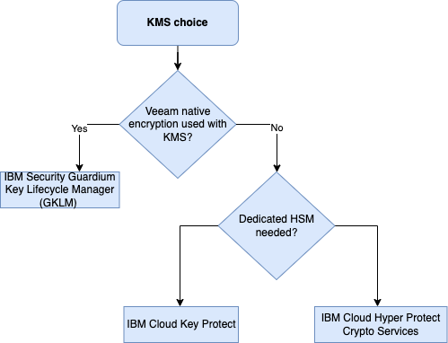
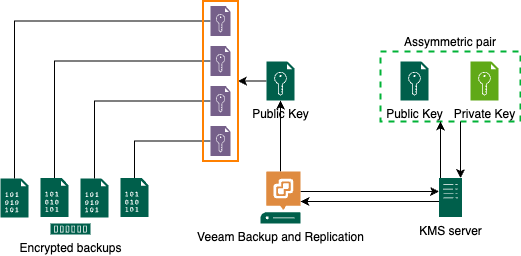

---
copyright:
  years: 2024
lastupdated: "2024-01-29"

subcollection: mware-cross-region-d

keywords:
---
{{site.data.keyword.attribute-definition-list}}

# Security design

{: \#security-design}

This document expands on the security aspect of the IBM Architecture framework in respect of the Veeam for disaster recovery for VMware workloads pattern.

Securing Veeam Backup and Continuous Data Protection (CDP) on VMware within the IBM Cloud environment requires careful consideration of various aspects to ensure the confidentiality, integrity, and availability of data.

## Requirements

The requirements for the security aspect for the Veeam for disaster recovery for VMware workloads pattern focuses on the following:

- Provide encryption at rest for the replicas at the recovery site.
- Provide encryption or privacy for the replication between the IBM Cloud regions.

## Security Design Considerations

| Security Areas                       | Description                                                                                                                                                                                                                                                                                                                                                                                                       |
| ------------------------------------ | ----------------------------------------------------------------------------------------------------------------------------------------------------------------------------------------------------------------------------------------------------------------------------------------------------------------------------------------------------------------------------------------------------------------- |
| **Network Security**           | **Isolation:** Ensure proper network isolation for the Veeam infrastructure components, such as the backup server, repository, and CDP proxy, from unauthorized access. **Firewall Rules:** Implement strict firewall rules to control traffic between Veeam components and other systems within the IBM Cloud environment.                                                                           |
| **Access Control**             | **Role-Based Access Control (RBAC):** Implement RBAC to restrict access to Veeam components based on job responsibilities, ensuring that only authorized personnel can configure, manage, and monitor the CDP solution. **Authentication:** Enforce strong authentication mechanisms, such as multi-factor authentication (MFA), for accessing the Veeam management console and associated interfaces |
| **Data Encryption**            | In-Transit Encryption: Enable encryption for data in transit between Veeam components and VMware infrastructure to prevent interception and tampering. Use secure communication protocols like TLS. At-Rest Encryption: Implement encryption for data at rest on storage repositories to protect against unauthorized access to backup and CDP data.                                                              |
| **Backup Repository Security** | **Access Controls:** Restrict access to the backup repository to only authorized personnel and systems. **Audit Trails:** Enable audit logging to track access and modifications to the backup repository, providing a trail of actions for security monitoring.                                                                                                                                      |
| **Vulnerability Management**   | **Regular Updates:** Keep Veeam software and underlying systems up-to-date with the latest security patches and updates to address potential vulnerabilities. **Scanning and Testing:** Regularly perform vulnerability assessments and penetration testing on the Veeam infrastructure to identify and remediate security weaknesses.                                                                |
| **Compliance**                 | **Regulatory Compliance:** Ensure that the Veeam CDP deployment within the IBM Cloud adheres to relevant industry regulations and compliance standards, such as GDPR, HIPAA, or any other applicable requirements.                                                                                                                                                                                          |
| **Data Residency and Privacy** | **Data Residency Policies:** Understand and comply with data residency requirements by configuring Veeam CDP to align with IBM Cloud's data residency policies. **Privacy Considerations:** Address privacy concerns by implementing anonymization or pseudonymization of sensitive data within backups                                                                                               |

By addressing these security requirements, organizations can establish a robust and resilient Veeam CDP deployment on VMware within the IBM Cloud environment, safeguarding critical data and ensuring the integrity of their backup and recovery processes.

## Veeam security and compliance analyzer

Veeam Backup & Replication provides a built-in tool, security and compliance analyzer, to ensure that the backup server configuration follows security best practices for Veeam backup infrastructure components based on Microsoft Windows Server and Linux operating systems. See [Security &amp; Compliance Analyzer](https://helpcenter.veeam.com/docs/backup/vsphere/best_practices_analyzer.html?zoom_highlight=best+practices&ver=120){: external}

## Native Veeam encryption

Veeam supports two types of encryption for backup operations:

- Job level encryption (applies only to a specific backup job).
- Capacity tier encryption (“data uploaded to object storage”), specific to scale out backup repository

The two types of encryption can be combined. Encryption is not retroactive, and if Veeam Backup Enterprise Backup Manager is not used, it will not be possible to restore data from encrypted backups without the password.

Veeam native encryption for backups and replicas uses either a symmetric encryption key derived from a password or asymmetric encryption keys generated by a Key Management Server (KMS) if one has been added.

Note that IBM Cloud Key Protect and IBM Cloud Hyper Protect Crypto Services KMS are not currently compatible with Veeam native encryption (password-based encryption can be used but will be entirely managed by Veeam). IBM Security Guardium Key Lifecycle Manager (GKLM) KMS is compatible with Veeam native encryption.

## vSphere encryption

Veeam supports backing up virtual machines encrypted with vSphere encryption, the only requirement for this is to have a Key Management Server already configured (which is a pre-requisite for vSphere encryption).

## Key Management Server(KMS)

Figure 1 KMS options decision tree

It is possible (and strongly recommended) to add a KMS (Key Management Server) server to the Veeam solution. Note that a KMS is needed for encrypted VM replication, without a KMS configured, the encrypted VMs will still be replicated, but the replica will be unencrypted.

Once a KMS has been added, Veeam requests the KMS server to generate an asymmetric KMS key for the required job or repository.

The generated public key is stored in the Veeam Backup & Replication configuration database and used for data encryption while the private key is stored on the KMS server and used for data decryption.

KMS server options on IBM Cloud:

1. IBM Cloud Key Protect (as a service shared HSM, not compatible with Veeam native encryption)
2. IBM Cloud Hyper Protect Crypto Service (as a service dedicated hardware HSM, not compatible with Veeam native encryption)
3. IBM Security Guardium Key Lifecycle Manager (GKLM) 4.1.1.0 and later (compatible with Veeam native encryption)

To integrate IBM Cloud Key Protect or Hyper Crypto Services with a VCS deployment a KMIP is needed, see [KMIP for VMware implementation and management](/docs/vmwaresolutions?topic=vmwaresolutions-kmip-implementation. However, currently this KMIP server cannot be used with Veeam {: note}

Consider IBM Security Guardium Key Lifecycle Manager for use with both Veeam and vSphere encryption, IBM Security Guardium Key Lifecycle Manager KMIP is supported by both Veeam and VMware.

Figure 2 Veeam KMS integration

## Encryption in transit for replication

Veeam supports encryption during replication using network traffic rules.

In this pattern, replication happens between two IBM Cloud regions leveraging IBM Cloud backbone and VRF. As a result the traffic is considered as being private and isolated and we do not consider encryption as being necessary.

In cases where encryption in transit is a mandatory requirement, the use of Veeam network traffic rules or the replication of vSphere encryption protected VMs would be the options.
